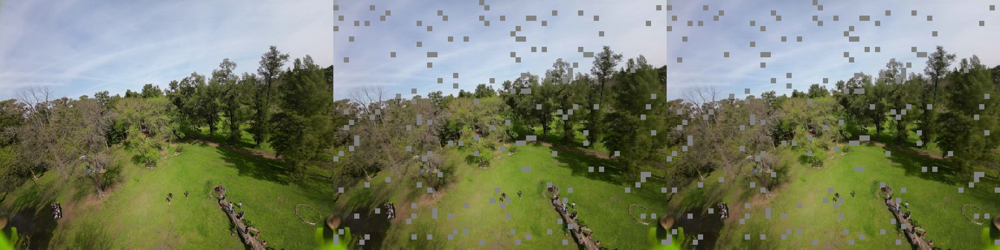

# Fixed-rate FPGA transform codec experiment

A Python reference model for a low-latency, fixed-rate image codec intended for
FPV video and future FPGA implementation.

The experiment compares two multiplier-light 4x4 transforms:

- an H.264-like integer transform;
- a 4x4 Walsh-Hadamard transform.

The default codec path uses deterministic integer arithmetic for the transform,
hierarchical DC coding, quantization and reconstruction. A legacy floating-point
path remains available as a quality reference.

> This repository is an image-level codec experiment, not a complete video
> transport. It currently has no temporal prediction, entropy coding, FEC or
> hardware-description-language implementation.

## Codec structure

Each independently decodable 16x16 macroblock contains:

- sixteen 4x4 luma blocks;
- four 4x4 Cb blocks;
- four 4x4 Cr blocks;
- YCbCr 4:2:0 chroma subsampling;
- a fixed number of payload bytes;
- fixed-width signed transform coefficients.

In the default hierarchical DC mode:

1. Every 4x4 block is transformed independently.
2. The sixteen luma DC coefficients are transformed by a second 4x4 Hadamard.
3. The four DC coefficients of each chroma plane use a 2x2 Hadamard.
4. The decoded DC level acts as a flat intra predictor for each 4x4 block.
5. AC coefficients encode detail around that predicted block level.
6. All prediction state resets at the 16x16 macroblock boundary, preserving
   packet independence.

The packet layout is deterministic: hierarchical DC coefficients first, then AC
coefficients for the 4x4 blocks in raster order.

## FPGA-oriented arithmetic

`--arithmetic fixed` is the default and models the intended codec datapath with:

- signed integer 4x4 transforms;
- fixed intermediate register widths;
- saturating intermediate arithmetic;
- integer Q8 quantizer configuration;
- fixed-width coefficient codes;
- round-to-nearest integer division, with exact halves rounded away from zero;
- integer Hadamard transforms implemented using additions and subtractions.

The H.264-like transform uses an exact integer inverse. Its two-dimensional
inverse divides by `400` with the rounding rule above. RTL must reproduce that
rule to remain bit-compatible with this model. A constant divider can be
implemented as a multiply/shift network with correction.

The console reports `saturations`. A non-zero value means that an internal
register width clipped at least one intermediate value and should be investigated
before translating the datapath to RTL.

The current RGB to YCbCr conversion and final YCbCr to RGB conversion remain
floating-point convenience wrappers. Before entering the codec datapath, Y, Cb
and Cr samples are rounded and clipped to unsigned 8-bit values. PSNR and SSIM
calculation also use floating point and are not part of the codec.

Use the previous floating-point transform model for comparison:

```bash
python fixed_transform_codec.py input.png --bytes-per-mb 24 --arithmetic float
```

## Requirements

- Python 3.10 or newer
- NumPy
- Pillow

Install the required packages:

```bash
python -m pip install numpy pillow
```

SSIM reporting is optional:

```bash
python -m pip install scikit-image
```

Without `scikit-image`, the SSIM column is printed as `n/a`.

## Quick start

Encode an image at 24 bytes per 16x16 macroblock:

```bash
python fixed_transform_codec.py input.png --bytes-per-mb 24
```

The order of the input argument and options is flexible. The following Windows
PowerShell command is equivalent:

```powershell
python .\fixed_transform_codec.py --bytes-per-mb 24 .\input.png
```

Outputs are written to `codec_results` by default. The comparison image layout
is:

```text
original | integer transform | Walsh-Hadamard transform
```

Save the two reconstructed images separately as well:

```bash
python fixed_transform_codec.py input.png --bytes-per-mb 24 --save-individual
```

Choose another output directory:

```bash
python fixed_transform_codec.py input.png --bytes-per-mb 24 --output-dir results
```

## Visual example

The repository includes the following 1024x768 test image:


Example command using the default fixed-point arithmetic, hierarchical DC,
24 bytes per macroblock and 5% simulated packet loss:

```bash
python fixed_transform_codec.py 1.png \
  --bytes-per-mb 24 \
  --packet-drop-rate 0.05
```

Result layout: original, integer transform and Walsh-Hadamard transform. Dropped
macroblocks use the default gray concealment:



## Rate sweep

Compare several fixed payload sizes in one run:

```bash
python fixed_transform_codec.py input.png --sweep 16,20,24,28,32,40,48,64
```

The console output contains:

- bytes per macroblock;
- transform name;
- bits per pixel;
- PSNR;
- SSIM when available;
- actual encoded bytes;
- dropped macroblocks;
- internal fixed-point saturation count.

## DC modes

Hierarchical DC is enabled by default:

```bash
python fixed_transform_codec.py input.png --dc-mode hadamard
```

The original independent block-DC mode remains available as a reference:

```bash
python fixed_transform_codec.py input.png --dc-mode block
```

Hierarchical DC gives the largest benefit at low payload sizes while retaining
independent 16x16 packets.

## Packet-loss simulation

`--packet-drop-rate` is a probability from `0.0` to `1.0`. For example, `0.20`
drops approximately 20% of the independently decoded macroblocks:

```bash
python fixed_transform_codec.py input.png \
  --bytes-per-mb 24 \
  --packet-drop-rate 0.20
```

Dropped macroblocks are gray by default:

```bash
python fixed_transform_codec.py input.png \
  --packet-drop-rate 0.20 \
  --loss-concealment gray
```

Simple spatial concealment copies the nearest received macroblock:

```bash
python fixed_transform_codec.py input.png \
  --packet-drop-rate 0.20 \
  --loss-concealment nearest
```

The random mask is reproducible with `--packet-drop-seed`. Lossy output names
include the loss percentage, for example `comparison_24B_drop20.png`.

Packet loss is modeled as loss of a complete macroblock payload, not corruption
of random bytes inside a payload. `encoded_bytes` reports the transmitted size;
`dropped_macroblocks` reports simulated receiver losses.

## Quality controls

The main tuning options are:

| Option | Default | Effect |
|---|---:|---|
| `--quality-scale` | `64.0` | Larger values use coarser quantization steps. |
| `--luma-share` | `0.75` | Fraction of the bit budget prioritized for luma. |
| `--chroma-quality-factor` | `0.6` | Scales chroma quantization relative to luma. |
| `--dc-mode` | `hadamard` | Selects hierarchical or legacy block DC. |
| `--arithmetic` | `fixed` | Selects FPGA-oriented or float-reference math. |

The allocator always preserves the requested total macroblock budget for the
normal even-byte operating points. Lower `--luma-share` assigns more bits to
Cb/Cr. Lower `--chroma-quality-factor` uses finer chroma quantization but may
reduce the representable chroma range.

## Reference quality

The following values were measured on the included 1024x768 `1.png`, using the
integer transform, hierarchical DC and default settings:

| Bytes per macroblock | Bits per pixel | Float reference PSNR | Fixed arithmetic PSNR |
|---:|---:|---:|---:|
| 16 | 0.500 | 27.061 dB | 27.047 dB |
| 20 | 0.625 | 27.505 dB | 27.491 dB |
| 24 | 0.750 | 27.874 dB | 27.859 dB |
| 28 | 0.875 | 28.204 dB | 28.187 dB |
| 32 | 1.000 | 28.696 dB | 28.674 dB |
| 40 | 1.250 | 28.787 dB | 28.769 dB |
| 48 | 1.500 | 29.043 dB | 29.024 dB |
| 64 | 2.000 | 30.130 dB | 30.105 dB |

The fixed-point penalty on this image is only 0.014 to 0.025 dB. Tests of
10,000 random blocks produced exact transform/inverse round trips without
quantization and zero intermediate saturations.

These values are useful for regression testing, not as a universal quality
benchmark. Results depend strongly on image content.

## Approximate 720p60 payload rates

For 1280x720 at 60 frames per second, ignoring packet headers, synchronization,
FEC and retransmission:

| Bytes per 16x16 macroblock | Payload bitrate |
|---:|---:|
| 16 | 27.65 Mbit/s |
| 20 | 34.56 Mbit/s |
| 24 | 41.47 Mbit/s |
| 28 | 48.38 Mbit/s |
| 32 | 55.30 Mbit/s |
| 40 | 69.12 Mbit/s |
| 48 | 82.94 Mbit/s |
| 64 | 110.59 Mbit/s |

## Current limitations

- RGB/YCbCr conversion is not yet a fixed-point hardware model.
- The reconstructed image currently uses the generated integer coefficient
  codes directly; a standalone byte-stream reader/decoder is not implemented.
- There is no entropy coding, temporal prediction or motion compensation.
- There is no rate control beyond the fixed macroblock budget.
- There is no FEC, packet header or transport framing model.
- Quantizer tables are tuned experimentally and are not a frozen bitstream
  specification.
- No RTL has been generated or verified against this Python model yet.

## Output files

Without `--save-individual`:

```text
comparison_XXB.png
comparison_XXB_dropYY.png
```

With `--save-individual`:

```text
integer_XXB.png
hadamard_XXB.png
comparison_XXB.png
```

Generated images and benchmark directories are development artifacts and do not
need to be committed unless they are intentionally used as documentation or
regression fixtures.
