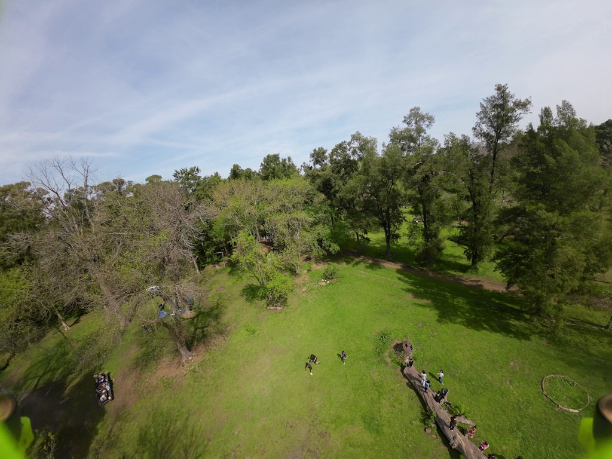
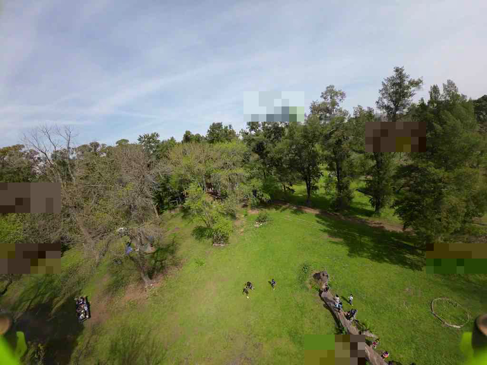

# FPGA-oriented JPEG-like radio codec

A Python reference model of a low-latency image codec for FPV radio and a
future FPGA implementation. The main implementation is
`jpeg_radio_codec.py`.

The codec uses integer 8×8 DCT, JPEG quantization and fixed Huffman tables, but
it is not a standard `.jpg` stream. File headers and tables are implicit, and
compact independently decodable 64×64 tiles are packed directly into radio
packets.

## Preview

Original 1024×768 test frame:



Default `medium` profile with a 10% loss probability referenced to an 890-byte
packet:



The deterministic run with seed `1234` dropped 6 of 96 variable-length packets.
All 12 affected tiles were reconstructed from low-frequency copies in the
preceding packets; no tile remained completely missing. PSNR is 28.732 dB.

## Current profiles

There is no configured minimum packet size and no padding to 700 bytes. A
packet contains exactly its 26-byte codec header plus meaningful payload and
must only stay below the selected maximum. The radio layer may accept packets
as small as 16 bytes, but the codec header itself is already larger, so a
separate 16-byte check would have no effect.

| Preset | Base Q | Max tile record | Actual packet range | Average packet | Wire bpp | Loss-free PSNR |
|---|---:|---:|---:|---:|---:|---:|
| `low` | 24 | 325 B | 206–692 B | 475.4 B | 0.4643 | 29.161 dB |
| **`medium` (default)** | **32** | **420 B** | **209–884 B** | **584.7 B** | **0.5710** | **30.086 dB** |
| `high` | 38 | 475 B | 213–994 B | 655.0 B | 0.6396 | 30.582 dB |

These measurements use the included `1.png`. The shorter packet in each range
is normally the final packet, which carries no next-packet LF backup.

## Intra prediction

Each 64×64 tile is split into sixteen 16×16 luma regions. A region selects one
of four two-bit modes:

- DC average;
- vertical prediction from the reconstructed top edge;
- horizontal prediction from the reconstructed left edge;
- planar interpolation from both edges.

The corresponding 8×8 Cb and Cr blocks share the luma mode, so mode signalling
costs only 32 bits per 64×64 tile. The mode is selected with a 4×4 Hadamard
SATD estimate using additions, subtractions and absolute values—no trial DCTs
or multipliers. The 16×16 luma residual is then encoded as four 8×8 DCT blocks;
Cb and Cr use one block each.

Encoder references are reconstructed from the coefficients that actually fit
in the entropy record, including quantization and any discarded AC tail. The
decoder therefore builds bit-identical references and cannot drift from the
encoder.

Prediction never crosses a 64×64 tile boundary. Top/left pixel references and
entropy state all reset at every tile. Residual DC is coded relative to zero in
every 8×8 block, which guarantees the baseline 11-bit DC category even at
manual quality 100 and removes another source of error propagation. Consequently a lost or
corrupt radio packet cannot affect decoding of any later packet. In a 20%
fixed-loss regression, all 156 primary tiles from surviving packets were
pixel-identical to the loss-free decode.

## Streaming and FPGA mapping

Processing uses one 16-line RGB window at a time. For each active tile the
encoder stores:

- the bounded entropy context (325, 420 or 475 bytes);
- 64 reconstructed top luma samples;
- 32 top Cb and 32 top Cr samples;
- the current 16/8/8-sample left edges;
- small mode/rate-control counters.

A complete 64-line pixel tile is not buffered. At 1280 pixels, medium-profile
entropy contexts use `20 × 420 = 8,400` bytes; intra top/left references add
about 3.2 KiB before memory packing and control overhead.

The codec datapath uses integer operations only:

- hard-coded signed Q14 DCT constants;
- signed 9-bit prediction residuals and a 13-bit first forward-DCT stage;
- integer round-to-nearest quantization and shifts;
- explicit saturation limits with a reported saturation counter;
- integer RGB/YCbCr conversion and 4:2:0 subsampling;
- fixed canonical baseline-JPEG Huffman tables.

NumPy stores arrays and Pillow handles PNG input/output. Floating point is used
only in the PSNR/test wrapper. All tested profiles and random/checkerboard
stress frames produced zero arithmetic saturations.

## Packet format and redundancy

Packet format version 5 contains:

```text
26 bytes       packet header, payload length and CRC32
variable       compact records for adjacent horizontal 64×64 tiles
12 B/tile      LF copies for the primary tiles in packet N+1
------------
actual length  no trailing padding; bounded only by --packet-bytes
```

The default maximum fits two worst-case 420-byte tile records and two LF
summaries. Tile records contain a four-byte header followed by their exact
entropy bytes; unused tile capacity is not transmitted.

Packet `N` carries a 12-byte low-frequency summary for every primary tile in
packet `N+1`: sixteen 4-bit luma averages plus four Cb and four Cr averages.
When `N+1` is lost, its coarse 64×64 content can be reconstructed from `N`.
There is intentionally no last-to-first wraparound buffer.

CRC32 covers the header and exact payload. A bad CRC, inconsistent payload
length, unsupported format version or oversized packet rejects the complete
packet.

## Compression results

| Implementation | Entropy bpp | Wire bpp | PSNR |
|---|---:|---:|---:|
| Intra `low` | 0.4079 | 0.4643 | 29.161 dB |
| **Intra `medium`** | **0.5146** | **0.5710** | **30.086 dB** |
| Intra `high` | 0.5832 | 0.6396 | 30.582 dB |
| Previous padded variable `medium` | 0.5005 | 0.7268 | 30.048 dB |
| Legacy integer transform, 64 B/MB | n/a | 2.0000 | 30.105 dB |

Compared with the previous medium profile, the new intra/no-padding stream has
slightly better quality (+0.038 dB) and 21.4% lower complete wire rate. Intra
mode signalling makes raw entropy slightly larger on this particular frame;
most of the wire saving comes from removing the artificial 700-byte packet
floor. The prediction is retained because it improves smooth/edge regions,
quality and future rate-control options without introducing loss propagation.

Approximate encoded payload at 1280×720 and 60 frames/s:

| Profile | Payload rate |
|---|---:|
| `low` | 25.67 Mbit/s |
| **`medium`** | **31.57 Mbit/s** |
| `high` | 35.37 Mbit/s |
| Legacy 2.0 bpp | 110.59 Mbit/s |

Radio PHY framing, modulation overhead and extra FEC are not included.

## Requirements and usage

- Python 3.10 or newer
- NumPy
- Pillow

```bash
python -m pip install numpy pillow
python jpeg_radio_codec.py 1.png
```

PowerShell examples:

```powershell
python .\jpeg_radio_codec.py .\1.png --quality-preset low
python .\jpeg_radio_codec.py .\1.png --quality-preset medium
python .\jpeg_radio_codec.py .\1.png --quality-preset high

python .\jpeg_radio_codec.py .\1.png `
  --packet-drop-rate 0.10 `
  --packet-drop-seed 1234
```

The default loss model scales probability with actual airtime:

```text
p_packet = 1 - (1 - p_reference) ^ (actual_packet_bytes / 890)
```

Use `--packet-loss-model fixed` to give every packet the same probability.
Use `--save-packets` to save raw version-5 packet files.

## Main options

| Option | Default | Description |
|---|---:|---|
| `--quality-preset` | `medium` | Select `low`, `medium` or `high`. |
| `--quality` | preset | Override base quantizer quality. |
| `--tile-bytes` | preset | Override maximum tile record capacity. |
| `--packet-bytes` | preset | Override maximum radio packet length. |
| `--packet-drop-rate` | `0.0` | Loss probability for an 890-byte reference packet. |
| `--packet-loss-model` | `length-scaled` | Airtime-scaled or fixed probability. |
| `--packet-drop-seed` | `1234` | Seed for reproducible loss simulation. |
| `--loss-concealment` | `gray` | Fallback: `gray` or `nearest`. |
| `--no-lf-backup` | off | Disable next-packet LF redundancy. |
| `--save-packets` | off | Save exact radio packets as `.bin`. |
| `--output-dir` | `jpeg_radio_results` | Output directory. |

The console reports entropy, maximum tile capacity and complete wire bpp,
actual packet min/average/max, effective loss probability, LF recoveries, PSNR
and arithmetic saturation count.

## Other experiments and limitations

- `fixed_transform_codec.py` is the earlier fixed-rate 4×4 integer/Hadamard
  transform experiment.
- `radio_packet_codec.py` is the earlier packet grouping model for that codec.
- There is no temporal prediction, motion compensation, radio PHY model, FEC,
  RTL implementation or bit-exact RTL co-simulation yet.
- Huffman tables are fixed rather than optimized per scene.
- The first packet cannot be recovered from an earlier LF copy.
