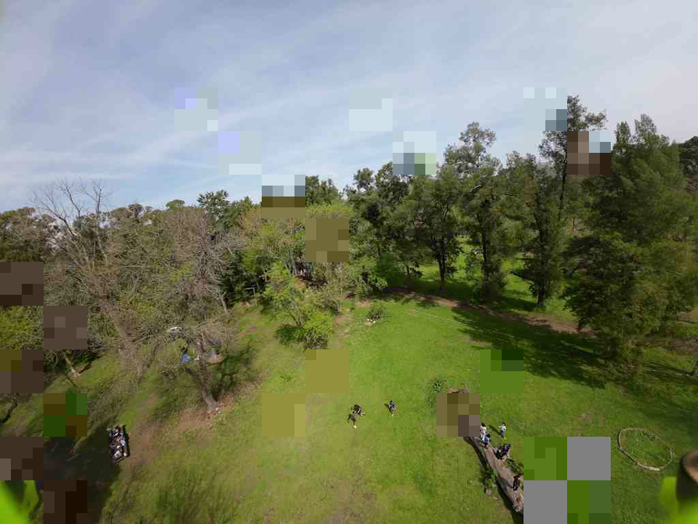

# FPGA-oriented JPEG-like radio codec
 
A Python reference model for a low-latency, fixed-packet image codec intended
for FPV video and a future FPGA implementation.

The main implementation is `jpeg_radio_codec.py`. It keeps the useful parts of
baseline JPEG—8×8 DCT, quantization, zigzag scan, differential DC coding, AC
run-length coding and canonical Huffman codes—but uses a custom transport
format. JPEG file headers and tables are fixed in the encoder and decoder and
are therefore not repeated over the radio link.

The codec is currently an intra-frame image experiment. It does not use motion
estimation or temporal prediction.

## Preview

Original 1024×768 test frame:


Decoded frame using the default 890-byte packet profile and 10% simulated
packet loss:



For this deterministic run, 11 of 96 packets were dropped. Twenty of the 22
affected 64×64 tiles were reconstructed from low-frequency copies carried by
the preceding packets. The measured PSNR of the saved preview is 26.730 dB.

## Current default profile

| Parameter | Value |
|---|---:|
| JPEG-like quality | 32 |
| Tile size | 64×64 pixels |
| Fixed tile slot | 420 bytes |
| Tiles per packet | 2 |
| LF backup per tile | 12 bytes |
| Packet header and CRC | 26 bytes |
| Fixed radio packet | 890 bytes |
| Loss-free PSNR on `1.png` | 30.251 dB |
| Complete radio rate | 0.8691 bits/pixel |

Every default packet is filled exactly:

```text
26 bytes   packet header and CRC32
840 bytes  two fixed 420-byte tile slots
24 bytes   LF copies for two tiles in packet N+1
---------
890 bytes  fixed transmitted packet length
```

The two primary tiles are selected diagonally inside a 128×128 area. Losing a
packet therefore removes two separated 64×64 detail regions rather than one
long horizontal strip.

## Codec pipeline

Each independently decodable 64×64 tile contains:

- 64 luma 8×8 blocks;
- 16 Cb and 16 Cr 8×8 blocks after YCbCr 4:2:0 subsampling;
- an integer Q14 two-dimensional DCT;
- JPEG-style luma and chroma quantization tables;
- zigzag coefficient order;
- differential DC coding reset at every tile;
- zero-run coding and fixed baseline JPEG Huffman tables;
- a four-byte tile header followed by entropy data and deterministic padding.

If a tile does not fit its fixed slot, only that tile lowers its quality until
it fits. Other tiles retain the requested quality. This makes the packet size
fully deterministic without truncating an entropy stream.

This is deliberately not a standard `.jpg` bitstream. The custom format avoids
repeated SOI, DQT, DHT, SOF and SOS structures and is simpler to reproduce in
RTL.

## Low-frequency redundancy

Packet `N` carries compact low-frequency summaries for the primary tiles of
packet `N+1`. Each 12-byte summary stores:

- sixteen 4-bit luma averages;
- four 4-bit Cb averages;
- four 4-bit Cr averages.

When packet `N+1` is lost, the decoder reconstructs a coarse 64×64 tile from
the copy in packet `N`. Fine detail is lost, but the large gray missing block is
usually avoided. The first packet of a frame intentionally has no preceding
backup; no wrap-around frame buffer is required in the FPGA.

CRC32 detects packet corruption. A packet with a wrong length, invalid padding
or CRC mismatch is rejected as a complete lost packet.

## FPGA-oriented arithmetic

The encoding and decoding datapath uses integer operations:

- hard-coded signed Q14 DCT constants;
- round-to-nearest shifts and integer quantization;
- explicitly limited transform and coefficient widths;
- saturating intermediate arithmetic with a reported saturation counter;
- integer RGB/YCbCr conversion and 4:2:0 downsampling;
- fixed canonical Huffman tables.

NumPy stores arrays and Pillow reads and writes PNG files, but no external JPEG
encoder or decoder participates in the codec path. PSNR calculation is a test
wrapper and may use floating point.

The tested profiles below produced zero arithmetic saturations on `1.png`.

## Requirements

- Python 3.10 or newer
- NumPy
- Pillow

Install the dependencies:

```bash
python -m pip install numpy pillow
```

## Quick start

Run the default 32/420/890 profile:

```bash
python jpeg_radio_codec.py 1.png
```

Windows PowerShell:

```powershell
python .\jpeg_radio_codec.py .\1.png
```

Simulate 10% packet loss using a reproducible random mask:

```powershell
python .\jpeg_radio_codec.py .\1.png `
  --packet-drop-rate 0.10 `
  --packet-drop-seed 1234
```

Use nearest-tile concealment for tiles that have neither primary data nor an LF
copy:

```powershell
python .\jpeg_radio_codec.py .\1.png `
  --packet-drop-rate 0.10 `
  --loss-concealment nearest
```

Save the raw fixed-size radio packets as `.bin` files:

```powershell
python .\jpeg_radio_codec.py .\1.png --save-packets
```

Outputs are written to `jpeg_radio_results` by default.

## Compression results

The following results were measured on the included 1024×768 `1.png`. `Wire
bpp` includes fixed-slot padding, packet headers, CRC, LF redundancy and final
packet padding.

| Profile | Packet | Tiles/packet | Entropy bpp | Wire bpp | PSNR |
|---|---:|---:|---:|---:|---:|
| Q24, 280-byte slot | 1200 B | 4 | 0.3762 | 0.5859 | 28.976 dB |
| Q28, 360-byte slot | 770 B | 2 | 0.4562 | 0.7520 | 29.781 dB |
| Q30, 400-byte slot | 850 B | 2 | 0.4903 | 0.8301 | 30.058 dB |
| **Q32, 420-byte slot (default)** | **890 B** | **2** | **0.5142** | **0.8691** | **30.251 dB** |
| Legacy integer transform, 64 B/MB | n/a | n/a | n/a | 2.0000 | 30.105 dB |

The default JPEG-like profile slightly exceeds the PSNR of the legacy
64-byte-per-macroblock codec while reducing the complete transmitted rate from
2.0000 to 0.8691 bits/pixel, approximately 2.30× fewer transmitted bits.

Approximate payload rates at 1280×720 and 60 frames/s:

| Profile | Approximate rate |
|---|---:|
| Q24 / 1200 B | 32.40 Mbit/s |
| Q28 / 770 B | 41.58 Mbit/s |
| Q30 / 850 B | 45.90 Mbit/s |
| **Q32 / 890 B** | **48.06 Mbit/s** |
| Legacy 2.0 bpp | 110.59 Mbit/s |

These values exclude radio PHY framing, modulation overhead and additional FEC.

## Main options

| Option | Default | Description |
|---|---:|---|
| `--quality` | `32` | Initial JPEG-style quality for every tile. |
| `--tile-bytes` | `420` | Fixed bytes reserved for each tile. |
| `--packet-bytes` | `890` | Exact transmitted packet length. |
| `--packet-drop-rate` | `0.0` | Probability of dropping a complete packet. |
| `--packet-drop-seed` | `1234` | Seed for reproducible loss simulation. |
| `--loss-concealment` | `gray` | Fallback: `gray` or `nearest`. |
| `--no-lf-backup` | off | Disable next-packet LF redundancy. |
| `--save-packets` | off | Save raw fixed-size packet files. |
| `--output-dir` | `jpeg_radio_results` | Output directory. |

The console reports entropy, fixed-slot and full wire bpp separately, along
with packet losses, LF recoveries, PSNR and arithmetic saturation count.

## Other experiments

- `fixed_transform_codec.py` is the earlier fixed-rate 4×4 integer/Hadamard
  transform experiment.
- `radio_packet_codec.py` is the earlier packet grouping and redundancy model
  for that transform codec.

They remain useful as regression and architecture references, but
`jpeg_radio_codec.py` is the current compression path.

## Current limitations

- Still-image intra coding only; no temporal prediction or motion compensation.
- No RTL implementation or bit-exact FPGA co-simulation yet.
- No radio PHY framing, interleaving or forward-error correction.
- Standard JPEG Huffman tables are fixed rather than optimized per content.
- The first packet of a frame cannot be recovered from an earlier LF copy.
- Tile quality adaptation is a simple exhaustive search, not a hardware rate
  controller yet.
