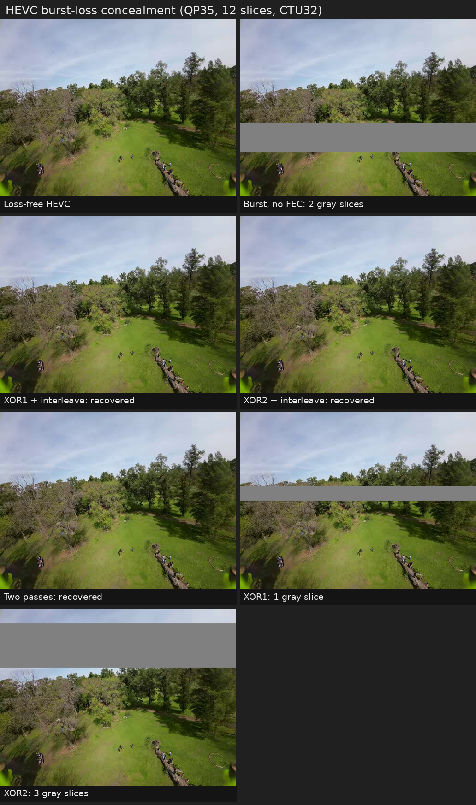

# HEVC/H.265 All-Intra radio experiment

This directory is independent from `jpeg_radio_codec.py`. The existing codec
and its packet format are not imported or modified.

`hevc_radio_experiment.py` uses FFmpeg/libx265 as a reference encoder and emits
a standard Main-profile HEVC Annex-B elementary stream. The receiver removes
the experimental radio wrapper and writes another standard `.hevc` file, so
the result can be decoded by normal software or a hardware HEVC decoder.

The experiment is now split into a thin compatible CLI and the
`hevc_reference` package. Deterministic Annex-B, radio framing, integer-width
helpers and the FPGA/ESP32 debug ABI live in the package. FFmpeg/libx265 is
isolated in `external_codec.py`: it remains a quality and standards oracle,
not a bit-exact model of the future FPGA encoder. See
[`REFERENCE_MODEL.md`](REFERENCE_MODEL.md) and
[`DEBUG_INTERFACE.md`](DEBUG_INTERFACE.md).

## Intended architecture

- Every video picture is encoded as a separately forced IDR/I access unit (no
  B pictures or lookahead): there are no temporal reference frames and no loss
  propagation between video frames. The reference script invokes the encoder
  once per picture. It advertises `keyint=2` only to make x265 signal the
  widely accelerated ordinary Main profile instead of Main-Intra/RExt.
- A picture is divided into full-width horizontal HEVC slices. Each slice is a
  separate VCL NAL and CABAC restarts at its beginning.
- SAO and deblocking are disabled in the default loss-oriented profile. This
  avoids reconstructed-pixel filtering dependencies across slice boundaries
  and reduces FPGA line-buffer requirements.
- VPS/SPS/PPS are assumed cached by a persistent receiver by default. They are
  prepended to the recovered Annex-B stream before decoding. Use
  `--parameter-sets in-band` to charge and simulate them in every frame.
- NALs larger than a radio packet are fragmented. A NAL is passed to the HEVC
  decoder only after every fragment has arrived or has been repaired.
- By default, an unrecoverable VCL NAL is replaced with a pre-encoded neutral
  gray slice at the same slice address. The rebuilt Annex-B stream remains
  standard HEVC, so an ordinary hardware decoder produces a clean full-width
  gray band instead of implementation-dependent green concealment. Use
  `--loss-concealment decoder` to observe the decoder's native behavior.

The radio framing is custom; the HEVC elementary stream is standard. The same
fragmentation concept can later be mapped to RFC 7798 HEVC Fragmentation Units
if RTP compatibility is needed.

## Requirements

- Python 3.10 or newer;
- NumPy and Pillow;
- FFmpeg built with the `libx265` encoder and an HEVC decoder.

```bash
python -m pip install numpy pillow
ffmpeg -hide_banner -encoders
```

Run the deterministic unit tests from the repository root:

```bash
PYTHONPATH=hevc_experiment python3 -m unittest discover -s hevc_experiment/tests -v
```

## Quick start

```powershell
python .\hevc_experiment\hevc_radio_experiment.py .\1.png
```

QP/slice sweep:

```powershell
python .\hevc_experiment\hevc_radio_experiment.py .\1.png `
  --sweep-qp 34 35 36 `
  --sweep-slices 1 4 12
```

Simulate packet loss:

```powershell
python .\hevc_experiment\hevc_radio_experiment.py .\1.png `
  --qp 35 --slices 12 --packet-bytes 890 `
  --packet-drop-rate 0.10 --packet-drop-seed 1234
```

Simulate measured burst-like losses instead of independent drops:

```powershell
python .\hevc_experiment\hevc_radio_experiment.py .\1.png `
  --packet-drop-rate 0.10 --loss-model burst `
  --burst-min-packets 2 --burst-max-packets 10
```

Transmit two time-separated copies of every fragment:

```powershell
python .\hevc_experiment\hevc_radio_experiment.py .\1.png `
  --qp 35 --copies 2 --packet-drop-rate 0.10
```

Add one or more interleaved XOR repair groups per fragmented NAL:

```powershell
python .\hevc_experiment\hevc_radio_experiment.py .\1.png `
  --qp 35 --xor-groups 2 --packet-drop-rate 0.10
```

Use the simplified encoder-search profile:

```powershell
python .\hevc_experiment\hevc_radio_experiment.py .\1.png `
  --ctu 32 --fpga-lite --qp 34
```

Every run directory contains:

- `encoded.hevc`: original standards-compatible Annex-B stream;
- `decoded.png`: loss-free FFmpeg decode;
- `recovered.hevc`: Annex-B stream rebuilt after radio loss/FEC;
- `recovered.png`: decoder output after radio loss/FEC/concealment;
- `gray_template.hevc`: locally generated standard gray-slice template when
  `--loss-concealment gray-slices` is enabled;
- `report.json`: compression, packet, slice and quality metrics, including the
  original incomplete and gray-concealed slice counts.

## Initial results on `1.png`

The current custom medium codec is the comparison point: 30.086 dB and 0.5710
complete radio bits/pixel.

| HEVC mode | QP | PSNR | Radio bpp | Largest slice |
|---|---:|---:|---:|---:|
| 1 slice, CTU64 | 35 | 30.235 dB | 0.2637 | 25.2 KiB |
| 12 slices, CTU64 | 35 | 30.231 dB | 0.2696 | 4.45 KiB |
| 12 slices, CTU32 | 35 | 30.223 dB | 0.2681 | 4.46 KiB |
| 12 slices, CTU16 | 35 | 30.162 dB | 0.2760 | 4.52 KiB |
| FPGA-lite, CTU32 | 34 | 30.324 dB | 0.3013 | 4.96 KiB |

At almost equal quality, 12-slice HEVC uses about 53% fewer radio bits than the
current codec before adding loss protection. Twelve independent slices cost
only about 2% compared with a single slice on this frame. CTU32 is the best
memory/compression compromise in this experiment.

The FPGA-lite output is still completely standard HEVC. It restricts
encoder-only CU/TU search and RDO tools; a hardware decoder needs no special
support. Its QP34 result still uses about 47% fewer radio bits than the current
codec at slightly higher PSNR.

## Packet-loss result

At QP35, 12 slices produce 36 radio fragments of at most 890 bytes. With a 10%
loss probability referenced to an 890-byte packet, 3000 deterministic random
masks gave:

| Protection | Radio bpp | All 12 slices survive |
|---|---:|---:|
| none | 0.2696 | 4.0% |
| one XOR group/slice | 0.3511 | 48.5% |
| two XOR groups/slice | 0.4326 | 58.9% |
| two complete copies | 0.5393 | 75.0% |
| two copies + one XOR group | 0.7022 | 98.5% |
| three complete copies | 0.8089 | 97.2% |

This is the central limitation: HEVC compression is much better, but losing a
fragment invalidates a much larger spatial slice. The ordinary decoder's
concealment is implementation-dependent and produced conspicuous green bands.
The default gray-slice substitution makes the failure deterministic and more
analog-like, but it does not recover image content; FEC or duplicated fragments
are still needed when intact detail matters.

For the fixed 1024×768, CTU32, 12-slice QP35 configuration, all 12 gray VCL
NAL templates occupy only 479 bytes including Annex-B start codes. They are
not radio overhead and need not be generated per frame in the real receiver:
the ESP32 can store one template set for each fixed SPS/PPS and slice layout,
then substitute only the required NAL before passing the frame to the decoder.



Two complete copies fit just below the present 0.5710-bpp budget and are a
useful baseline, but a 75% probability of an entirely intact frame at 10%
independent packet loss is not sufficient on its own.

### Burst-loss measurement

Real radio measurements show that losses are usually consecutive runs of 2–10
packets rather than independent events. `--loss-model burst` clusters the
requested total loss into runs in that range. The model is deliberately
conservative: if the target count is not reached by the first run, it may place
another run elsewhere in the frame.

For CTU32/QP35 and 10% total loss, 5000 burst masks gave:

| Protection/order | Radio bpp | All slices survive | Mean missing slices |
|---|---:|---:|---:|
| none, NAL order | 0.2681 | 0.0% | 2.06 |
| none, round-robin | 0.2681 | 0.0% | 3.80 |
| 1 XOR group, NAL order | 0.3496 | 0.3% | 1.33 |
| 1 XOR group, round-robin | 0.3496 | 76.1% | 0.32 |
| 2 XOR groups, round-robin | 0.4311 | 84.6% | 0.23 |
| 2 full passes | 0.5362 | 94.3% | 0.07 |

This reverses an important conclusion from the independent-loss model. A
second complete pass is highly effective because matching copies are separated
by an entire 36-packet frame, much longer than the observed 2–10-packet burst.
It also preserves minimum latency: primary fragments may be transmitted as
soon as they are produced; only the later repair pass needs a compressed-frame
buffer.

Round-robin order is useful only together with per-slice FEC. Without FEC it
spreads one burst across more slices and makes concealment worse. With XOR it
turns a burst into approximately one missing fragment per slice, which each
slice parity packet can repair.

## FPGA memory and complexity

All-Intra removes full reference-frame storage and motion estimation. A
streaming implementation can work from a source-line window plus reconstructed
top/left boundaries. With CTU32 and 4:2:0 8-bit input, one uncompressed CTU is
1.5 KiB; source plus reconstruction is about 3 KiB before residual,
coefficient and candidate storage. Top-edge samples at 1280 pixels are about
1.9 KiB for Y/Cb/Cr. Disabling SAO and deblock avoids several additional
filtered line buffers.

A realistic single-CTU streaming encoder is likely to need roughly 12–24 KiB
of block/line/context RAM, depending on how aggressively buffers are reused.
Radio fragmentation adds at most one 866-byte accumulator per XOR group.

The harder problem is logic and throughput, not RAM:

- HEVC has up to 35 intra directions plus planar/DC;
- recursive CU/TU decisions and 4/8/16/32 transforms;
- transform/quantization reconstruction for prediction references;
- CABAC context modeling and renormalization;
- rate control and slice size variability.

`--fpga-lite` reduces the search to CTU32, minimum CU16, maximum TU16 and
cheaper RDO settings, but libx265 is only a compression proxy—not a cycle- or
memory-accurate FPGA implementation. A custom RTL encoder would probably need
to restrict the tested intra modes further while keeping the emitted syntax
standard.

### T20F169 target

The selected T20F169 has 19,728 logic elements, 204 × 5-kbit RAM blocks
(1,044.48 kbit, about 130.6 KiB raw) and 36 signed 18×18 multipliers. Compared
with T13 this is approximately 54% more logic, 44% more embedded RAM and 50%
more multipliers. The F169 package also provides 73 GPIO and two MIPI RX/TX
interfaces, but no external DDR interface.

The 25.6-KiB QP35 HEVC access unit fits comfortably in embedded RAM. Allowing
for 5-kbit block granularity, a double-pass buffer plus the estimated 12–24 KiB
streaming codec state should remain within the T20 memory budget. Two physical
copies are not required in RAM: one stored compressed frame can simply be read
twice.

T20 therefore makes packet buffering and burst protection practical. It does
not automatically make a full x265-like encoder practical. The 36 multipliers
are enough for a carefully time-multiplexed transform pipeline, but exhaustive
HEVC intra mode/CU/TU search and CABAC at 720p60 remain tight. The realistic
target is the standard-compatible FPGA-lite subset with CTU32, CU/TU limits,
few evaluated intra modes and one reconstructed CTU pipeline. Fit and timing
must ultimately be established by RTL synthesis; the Python/x265 experiment
cannot prove them.

The synthesized RTL slice now provides normative filtered 16x16 luma DC and
planar prediction, signed residual generation, DC/planar SAD selection and
clipped reconstruction. The planar recurrence contains no multipliers. Summing
separate generic Yosys LUT4 mappings gives about 1,678 LUT4 and 946 flip-flops,
with no DSP or EBR use. That is still small relative to the T20, but it excludes
transform/quantization, retained source rows, syntax generation and CABAC.
Flattened Efinity synthesis remains the authoritative fit measurement and may
share some logic between the candidate paths.

A separable 16x16 forward transform is also implemented with normative 8-bit
shifts and rounding. It reuses 15 inferred constant multipliers plus one
shift-only channel across both passes and infers one 4096-bit transpose RAM.
The no-stall block interval is 561 cycles, requiring approximately 121.2 MHz
for the pessimistic case where every 720p60 luma sample belongs to a TU16. A
pure LUT4 mapping of the transform is about 8,483 LUT4 and 867 flip-flops; this
is an upper bound because the intended T20 mapping uses up to 15 of its 36 DSP
blocks and one of its 204 EBR blocks.

## Practical conclusion

Standard-compatible HEVC All-Intra is technically applicable and demonstrates
a real compression advantage. It is most attractive if encoding moves to a
larger FPGA/ASIC while decoding remains on a CPU/GPU/SoC HEVC block.

For the small T13 FPGA, a full HEVC encoder is substantially riskier than the
current codec even without temporal prediction. A constrained HEVC subset is
possible in principle, but CABAC, mode search and reconstruction throughput are
likely to require more DSP/logic than T13 provides. The next useful experiment
is an RTL-oriented subset estimator with a fixed set of intra modes and
transform sizes, plus stronger packet FEC or a low-frequency side layer.
